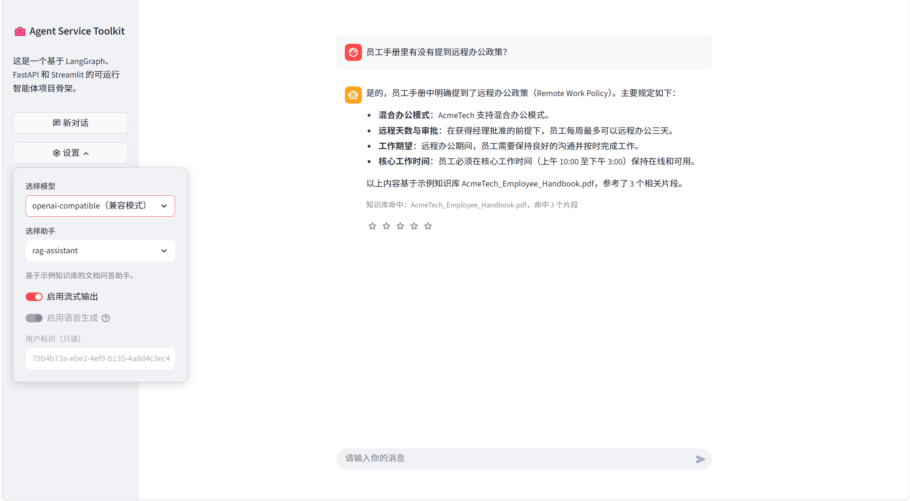

# 🧰 Agent Service Toolkit

一个基于 LangGraph、FastAPI 和 Streamlit 的完整 Agent 应用骨架，包含服务端、客户端和可直接交互的 Web 界面。

这个仓库适合用来继续做两类事情：

- 作为本地可运行的 Agent 工程继续开发
- 作为一个完整示例，学习 `UI -> Client -> Service -> Agent` 的整体链路

当前已经完成并验证：

- FastAPI 服务可启动
- Streamlit 页面可打开
- `UI -> Client -> Service -> Agent` 链路已跑通
- fake model 演示模式可用
- 阿里云百炼 `OpenAI-compatible` 接法可用
- 页面主要可见文案已完成第一轮中文化
- `rag-assistant` 已改为固定先检索、后回答
- 本地 RAG 真实演示已可基于 `AcmeTech_Employee_Handbook.pdf` 稳定区分命中 / 未命中问题

当前推荐本地运行基线：

- FastAPI：`8081`
- Streamlit：`8501`
- 默认模型：`openai-compatible`

## 公开演示入口

如果你是第一次打开这个仓库，最值得优先体验的是当前这条本地 RAG demo：

- 助手：`rag-assistant`
- 推荐模型：`openai-compatible`
- 知识库：`data/AcmeTech_Employee_Handbook.pdf`
- 服务端口：`8081`
- 页面端口：`8501`

建议先问一题“应命中”的问题，再问一题“未命中”的问题，这样最容易看出当前版本的真实效果：

- 应命中：`员工手册里有没有提到远程办公政策？`
- 未命中：`CTO 的邮箱地址是什么？`

当前理想表现：

- 命中题会给出贴近手册内容的回答，并显示 `知识库命中`
- 未命中题会明确提示当前示例知识库没有相关内容，并显示 `知识库未命中`
- 如果知识库检索本身出错，回答会单独提示当前暂时无法可靠作答，并显示 `知识库检索异常`
- 当前 `rag-assistant` 在页面里会保留消息级流式体验，但不会逐 token 暴露模型原始正文；知识库提示统一以下方 badge 为准

## 界面截图

下面这张图展示的是当前仓库里的 RAG 命中示例：



说明：

- 这张截图对应的是 `rag-assistant` + `openai-compatible` 的本地演示路径
- 页面中可直接看到知识库命中结果和命中片段提示
- 如果你本地复现演示，建议优先使用同一个问题：`员工手册里有没有提到远程办公政策？`

## 项目简介

项目当前包含一条完整的本地交互链路：

- `src/service/service.py` 提供 FastAPI 服务入口
- `src/client/client.py` 负责和服务通信
- `src/streamlit_app.py` 提供聊天式交互界面
- `src/agents/` 提供多个 Agent 实现
- `src/core/settings.py` 管理模型、环境变量和运行模式
当前这一版已经完成基础运行验证，并在此基础上继续做中文化、配置收敛和项目整理。

## 当前版本定位

这不是一个全新从零搭建的模板仓库，而是基于现有可运行项目继续收敛后的版本。当前方向是：

- 保留当前仓库根目录作为真正可运行的项目主体
- 保留并继续完善 Streamlit 页面中文化
- 使用已经在本地跑通的 OpenAI-compatible 模型接法
- 排除本地记录、日志、缓存、数据库等非项目产物
- 逐步把 README、配置说明和界面表达改造成自己的版本

## 目录说明

- `src/`：项目源码
- `tests/`：测试代码
- `docs/`：补充说明文档
- `media/`：项目图片资源
- `docker/`：Docker 相关配置
- `privatecredentials/`：本地凭据占位目录
- `.local/`：本地 SQLite 与运行数据目录，不上传
- `.env`：本地私有配置，不上传

## 快速开始

推荐按当前本地版本的方式启动。

### 1. 准备配置

```sh
cp .env.example .env
```

推荐按下面的方向填写：

```env
DEFAULT_MODEL=openai-compatible
COMPATIBLE_MODEL=qwen-plus
COMPATIBLE_API_KEY=your_compatible_api_key
COMPATIBLE_BASE_URL=https://dashscope.aliyuncs.com/compatible-mode/v1
PORT=8081
AGENT_URL=http://127.0.0.1:8081
```

如果当前 shell 或系统环境里残留 `OPENAI_API_KEY`，而你又只想保留 compatible provider，请先清掉它，否则 `AVAILABLE_MODELS` 里仍可能混入 `gpt-*`。

### 2. 安装依赖

```sh
uv sync --frozen
source .venv/bin/activate
```

### 3. 启动 FastAPI 服务

```sh
python src/run_service.py
```

### 4. 启动 Streamlit 界面

```sh
source .venv/bin/activate
streamlit run src/streamlit_app.py
```

### 5. 访问页面

- Streamlit：`http://localhost:8501`
- FastAPI 文档：`http://127.0.0.1:8081/redoc`

## 推荐配置说明

当前这版更推荐使用 OpenAI-compatible 模式，而不是直接把 `OPENAI_API_KEY` 当默认起点。

推荐重点关注这些变量：

- `DEFAULT_MODEL=openai-compatible`
- `COMPATIBLE_MODEL`
- `COMPATIBLE_API_KEY`
- `COMPATIBLE_BASE_URL`
- `PORT=8081`
- `AGENT_URL=http://127.0.0.1:8081`

如果后续出现 provider 混乱，优先检查：

- 当前 shell 是否仍导出了 `OPENAI_API_KEY`
- 服务进程是否已经真正重启
- `src/core/settings.py` 实际读到的模型配置

## 当前 RAG 演示状态

当前仓库内置了一条可以直接演示的本地 RAG 路线：

- 示例知识库：`data/AcmeTech_Employee_Handbook.pdf`
- 向量库：本地 Chroma
- 入口助手：`rag-assistant`
- 当前推荐模型：`openai-compatible`

这一版已经做过几轮真实手工问答，当前目标不是“做最复杂的 RAG 架构”，而是保留一条清晰、稳定、便于继续学习和展示的最小链路。

当前这条 RAG 线已经具备：

- 命中时优先基于检索结果回答
- 未命中时稳定返回统一提示
- 页面展示当前知识库命中状态
- 中文问题检索英文示例手册时，带有轻量检索增强

建议手工演示时优先测试两类问题：

1. 应该命中的问题
   - `员工手册里有没有提到远程办公政策？`
   - `员工福利相关内容主要包括什么？`
   - `员工手册里如何描述休假或请假政策？`
2. 理论上不该命中的问题
   - `CTO 的邮箱地址是什么？`
   - `公司今年招聘多少个实习生？`
   - `今年年终奖具体公式是什么？`

理想表现是：

- 命中题会给出贴近手册内容的回答，并显示 `知识库命中`
- 未命中题会明确提示当前示例知识库没有直接相关内容，并显示 `知识库未命中`

### 演示顺序建议

如果你是准备把这个仓库展示给别人看，最稳妥的演示顺序是：

1. 先展示首页里的知识库状态
2. 再确认助手切到 `rag-assistant`
3. 先问一题应命中问题
4. 再问一题未命中问题

## 当前主要能力

1. 多 Agent 切换与调用
2. 流式输出与工具调用展示
3. Streamlit 聊天界面
4. FastAPI 服务封装
5. 可切换的模型 provider 配置
6. 语音输入 / 输出扩展接口
7. RAG assistant 示例

## 后续适合继续改造的方向

- 继续完善页面中文化和品牌化
- 继续收敛默认 provider 策略
- 根据自己的使用场景定制 `src/agents/`
- 继续改造界面文案、项目命名和 README 结构
- 继续做轻量、可验证的 RAG 结果打磨，而不是大改框架

## 相关文档

- [Setting up Ollama](docs/Ollama.md)
- [Setting up VertexAI](docs/VertexAI.md)
- [Setting up RAG with ChromaDB](docs/RAG_Assistant.md)
- [Working with File-based Credentials](docs/File_Based_Credentials.md)

## 私有凭据文件

如果某些 Agent 或模型 provider 需要证书、凭据文件或其他本地私有材料，可以放到 `privatecredentials/`。该目录默认忽略真实内容，只保留 `.gitkeep` 占位文件。

## Docker

仓库保留了 `compose.yaml` 和 `docker/` 配置，后续如需回到 Docker 路线可以继续使用。

不过当前这版的主要验证工作是在本地 Python 运行路径下完成的，因此继续改造时更推荐优先沿用本地运行方式。

## 测试

可在本地虚拟环境中运行测试：

```sh
uv sync --frozen
source .venv/bin/activate
pytest
```

## License

This project is licensed under the MIT License - see the LICENSE file for details.
